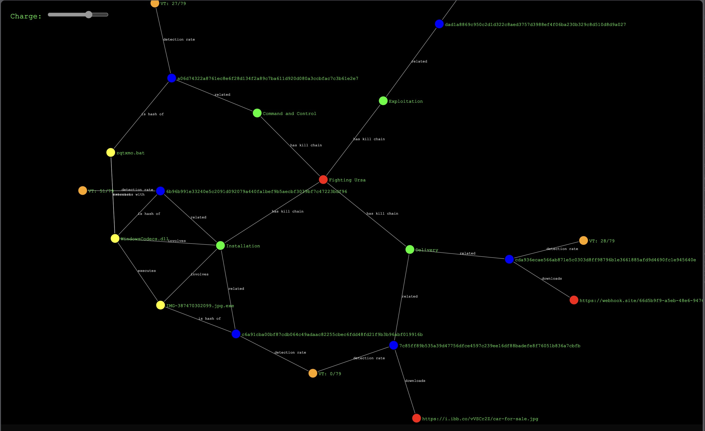

# tiny-TI
A tiny OSINT threat intelligence demo with LLM, so OSINT is no longer useless.

It loads a security research blog post or a report URL, builds a knowledge graph of IoCs, behavior patterns, and the event overview in kill chain steps, with JSON output and a knowledge graph visualization in d3.js. It also validates IoCs with external vendors like VirusTotal.

It is just a start for many future possibilities. For example, it is possible for a NLP TI engine to answer "who else had similar behavior to Fancy Bear attack".

Screenshot:



## How to use

Simple setup

```
pip install -r requirements.txt
export OPENAI_API_KEY=sk-proj-....
export VIRUSTOTAL_API_KEY=....
```

Run it (if had previous run, use `--use-cache` to save some VirusTotal API waiting time)
```
python run.py https://unit42.paloaltonetworks.com/fighting-ursa-car-for-sale-phishing-lure/ [--use-cache]
```

the `example` folder has the output JSON and visualization HTML using d3.js. The JSON output has much richer information beyond visualization.

## How it works

Extracting threat intelligence from reports is always tricky with regex: the reports may mention a file name or a hash code or an URL anywhere, and use natural language to describe the logic. The IoCs may be masked like `hxxps` or `127[.]0[.]0[.]1`. Not mentioning other hacker's string preference. The same report can include many legit links like reference or further reading, which may confuse a regex for malicious URL pattern matching. They are the major sources of "em, OSINT threat intelligence has high false positive!"

A LLM with right prompting can play a smart regex role to understand such patterns, extract IoCs and relate them into events. Further more, these extracted IoC can further link to other sources of both external and internal intelligence. This repo is a minimal implementation of such approach.

## Next steps

* I know you have a list of report RSS feeds
* You also know how to parse your PDF report repos
* Your friend has a nice crawler for darkweb as well.
* You have your in-house intelligence repo and many external vendors.
* And you can prompt to add more schema, right?
* You can also build a NLP search engine on all OSINT using these JSONs and graphs, like "who else had similar behavior to Fancy Bear attack"
* Do you want to scale up this knowledge graph? consider something else rather than neo4j.